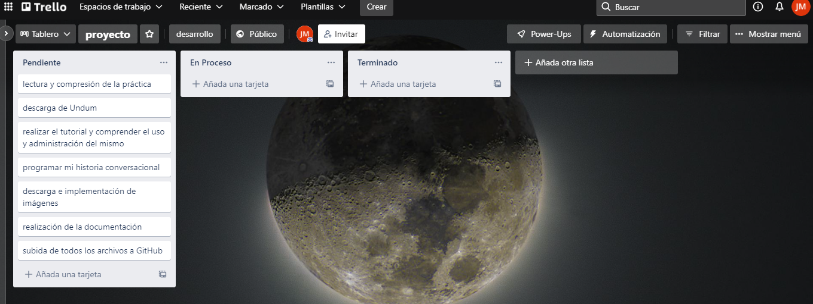

# Práctica 2 Desarrollo Ágil

## Índice

* [Autor](#autor)
* [Descripción del juego](#descripción-del-juego)
* [Capturas de pantalla del tablero Trello](#capturas-de-pantalla-del-tablero-trello)
* [Capturas en la app telegram](#capturas-en-la-app-telegram)

## Autor

* **nombre**: Juan Moya Moya 
* **correo**:jmm00149@red.ujaen.es
* **GitHub**:https://github.com/jmm00149
* **Trello**:https://trello.com/b/6FVxYQIR/proyecto
* **Telegram**:@juanmoya8

## Descripción del juego
## Un día por Jaén

En este juego, eres una persona normal y corriente que decide en su día libre hacer algo distinto y salir con su pareja
por la increíble ciudad de Jaén. En este juego, tu tomas el control de las distintas decisiones, tienes la gran responsabilidad
de que al final de este juego, nuestra entrañable pareja haya pasado un maravilloso día o un día no tan bueno...

## Capturas de pantalla del tablero Trello

**al principio del proyecto**

**a mitad del proyecto**

**al final del proyecto**

## Capturas en la app Telegram

**vinculación con Trello**

**vinculación con GitHub**

